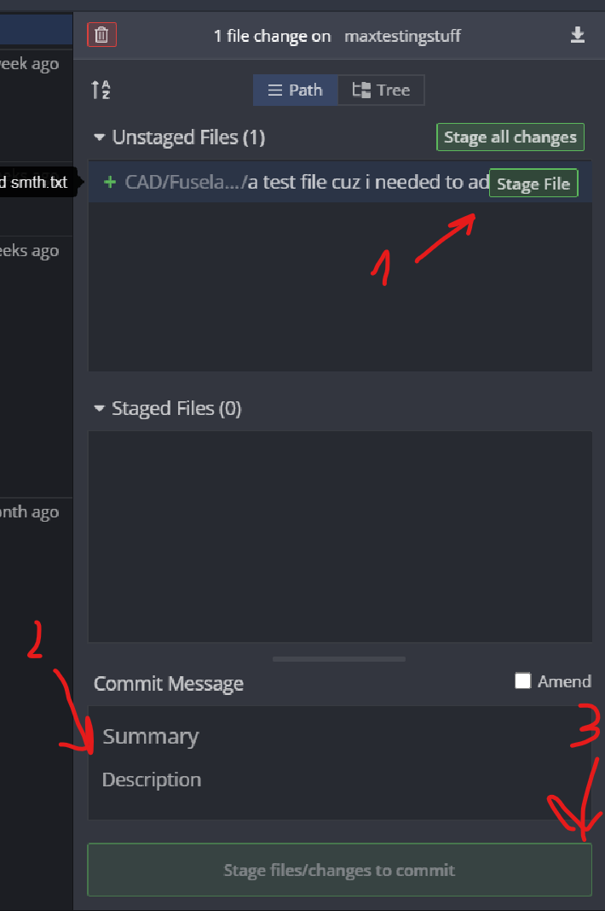

# Haggis Aerospace Main Repository
>A document outlining the method to use to work on the main repo and all subsequent repos managed by Haggis Aerospace.

## Requirements
- **Git** (https://git-scm.com/)
- **gitKraken** (https://www.gitkraken.com/) (our choice of interacting with git due to its simplicity and ease of use)
- **GitHub Account** (https://www.github.com/) (get intouch with **@FlaminDemigod** on the discord to get added to the repo as a collaborator)

## Workflow
>If you have never used git before, you can check this handy dandy guide by github (<https://guides.github.com/introduction/git-handbook/>).
However for this guide, we are going to assume you know nothing about git to make this easier for the uninitiated.
### Cloning the Repo
Open gitKraken, Press “clone repo”(a fancy term for download, however you need to clone the repo so that git can sync your changes with the cloud), open with URL. choose a folder where the project will be stored and input the URL of the repo (in our case this will be <https://github.com/haggis-aerospace/haggisAero-2020/> ) 

### Making a Branch and Pulling
Now you have the master Repo downloaded. The project is stored on multiple branches and only once a certain branch is considered finished it is merged with the master branch.Currently the master branch is empty, since we are in the prototype stage

>Git repos use the concept of branches of a tree. Everytime a major change needs to be made in the repo you __must__ make a branch of the repo (this can be from a pre-existing branch or from master).

To work in a particular branch you need to create your own branch (so you don't accidentally break something). to do so press “Branch”.

Enter the Branch name (try to be as informative as possible, include your name) and hit enter.
After that, press Pull to download the files. 

> The act of performing a pull on a repo is used to make sure you have the required files for the branch as anyone else can make changes to said branch. This is used to make sure you are working on the most recent version of all the files.

You will be asked which existing branch to copy files from. Type the name of the branch (caps sensitive). 

Than hit submit. After that Press Pull again. You should now have the files from that branch Downloaded to your computer.
Feel free to change things as it is a local only copy and does not affect the actual version of your files. Once you feel like what you have done is ready for the world, follow the next steps.

### Commiting your changes
Choose the files that you changed or added by pressing “stage file” or “stage all changes” to select all of them at once.

> "Staging" a file merely prepares the file to be uploaded. The diffrence between staging one file or all files is only to do with the commit. 
> "Commit" is basically a term for a set of files given to the main repo saying that these are the next set of changes. They help keep track of the changes made to the repo. And in the event of a bad change, can always be reverted to the previous commit. 

Add a commit message. Try to be as informative as possible, no asdasdafafa’s and the like. 
> Commits always have messages associated with them and they should be used to describe the changes that were made.

Once you feel like its good, hit “Stage files/changes to commit”

Once that is done Hit the “Push”button on top to send it to the main server for everyone to see.
>"Push" is a fancy but descriptive term for adding the commit to the main repo. After you do this your changes can be seen by everyone.

And that's it! If you need to work on multiple branches at once, create another branch and follow the same instruction. If you have Questions, don't be shy and ask!
